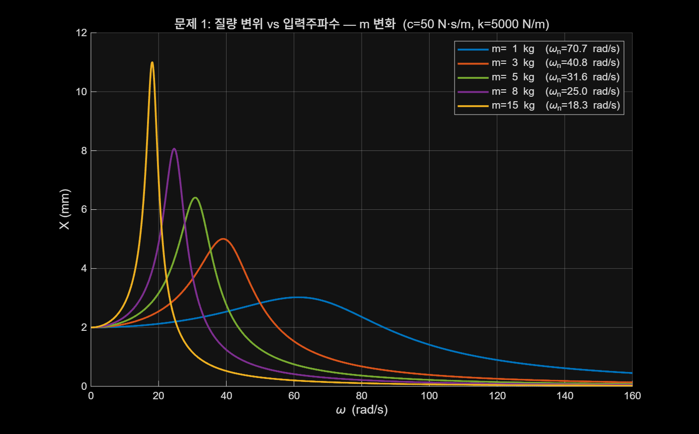
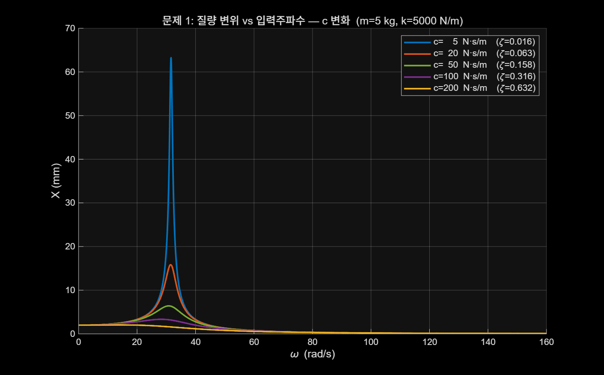
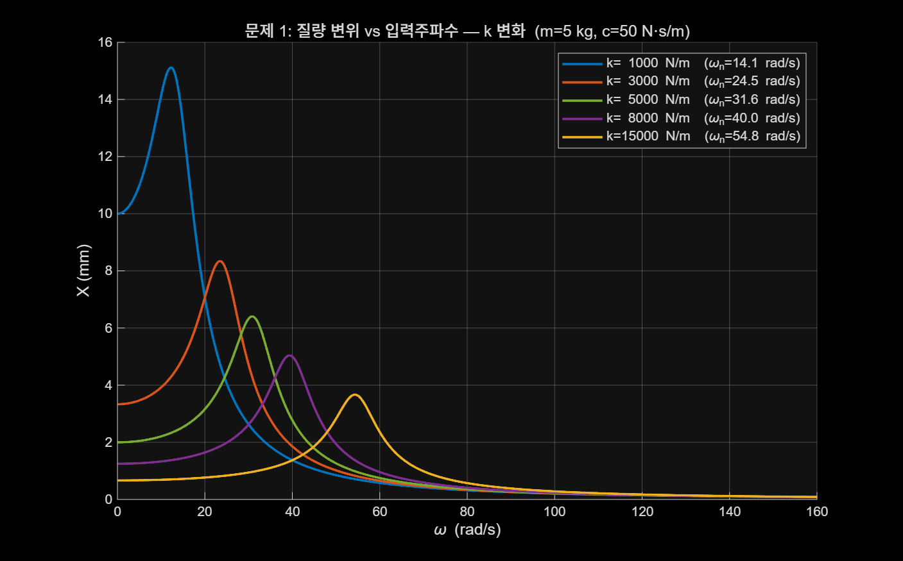
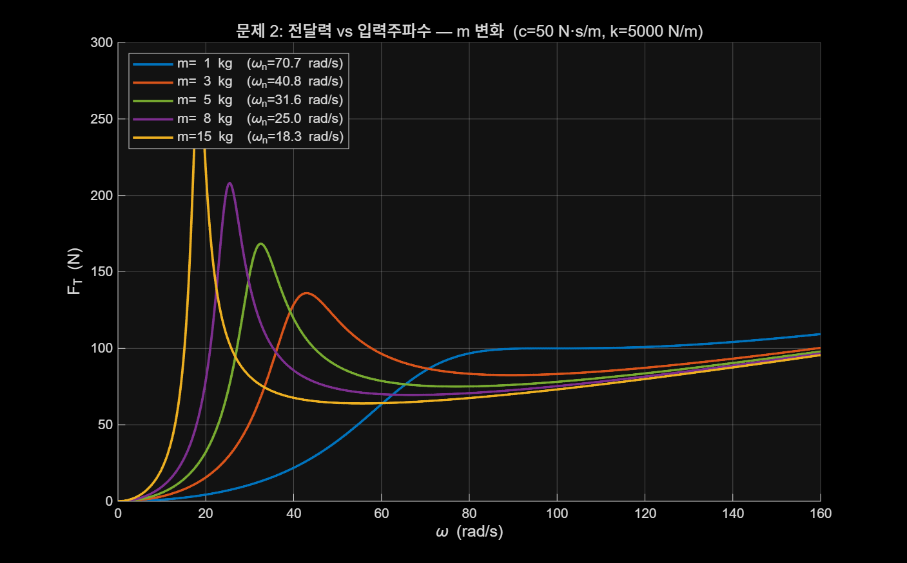
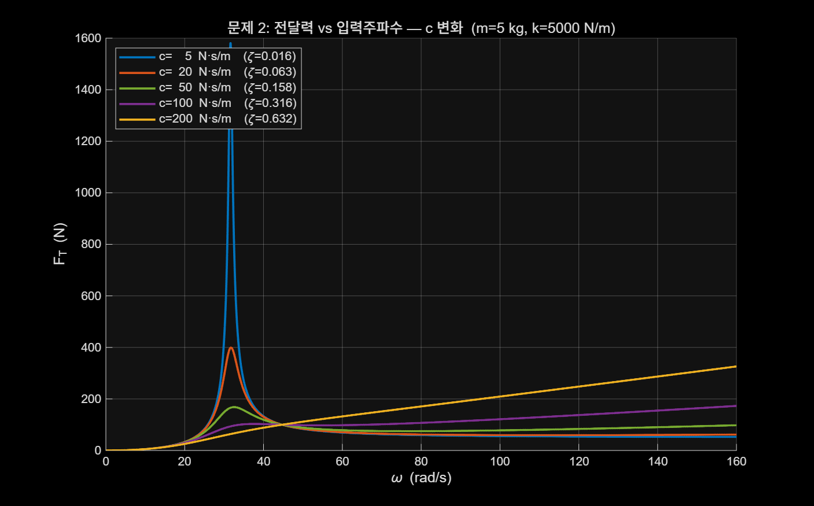
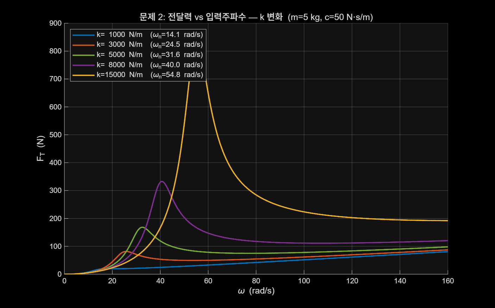

# 진동학 Homework #2

전북대학교 산업정보시스템공학과  
202116971 김영환

질량-스프링-댐퍼 시스템의 주파수 응답 분석  
과제 1: 조화 외력 가진에서 질량 변위 $X$  
과제 2: 바닥 가진에서 전달력 $F_T$

---

## 해석 조건

공통으로 사용한 값은 아래와 같다.

| 항목 | 값 |
|---|---|
| 가진력 $F$ | 10 N |
| 바닥 변위 진폭 $Y$ | 0.01 m |
| 주파수 범위 $\omega$ | 0.1 ~ 160 rad/s |
| 기준 질량 $m$ | 5 kg |
| 기준 감쇠 $c$ | 50 N·s/m |
| 기준 강성 $k$ | 5000 N/m |

변화 범위는 공진점이 탐색 범위 안에 들어오고, 저감쇠부터 고감쇠까지 차이가 보이도록 설정하였다.

---

## 문제 1. 조화 외력 가진

운동방정식은

$$
m\ddot{x}+c\dot{x}+kx = F\sin(\omega t)
$$

정상상태에서 변위 진폭은

$$
X=\frac{F}{\sqrt{(k-m\omega^2)^2+(c\omega)^2}}
$$

---

## 문제 1-(a) m 변화

기준: $c=50$, $k=5000$



---

## 문제 1-(a) m 변화 해석

| $m$ (kg) | $\omega_n$ (rad/s) | 최대 변위 $X_{\max}$ (mm) |
|---|---:|---:|
| 1 | 70.7 | 3.02 |
| 3 | 40.8 | 5.00 |
| 5 | 31.6 | 6.41 |
| 8 | 25.0 | 8.06 |
| 15 | 18.3 | 11.00 |

- $m$ 이 커질수록 $\omega_n=\sqrt{k/m}$ 이 작아져 공진점이 왼쪽으로 이동했다.
- 공진 부근 최대 변위는 `3.02 mm -> 11.00 mm`로 증가했다.
- 고주파에서는 $X \approx F/(m\omega^2)$ 이므로 큰 질량일수록 응답이 더 빨리 줄었다.

---

## 문제 1-(b) c 변화

기준: $m=5$, $k=5000$



---

## 문제 1-(b) c 변화 해석

| $c$ (N·s/m) | $\zeta$ | 최대 변위 $X_{\max}$ (mm) |
|---|---:|---:|
| 5 | 0.016 | 63.25 |
| 20 | 0.063 | 15.84 |
| 50 | 0.158 | 6.41 |
| 100 | 0.316 | 3.33 |
| 200 | 0.632 | 2.04 |

- 감쇠는 자연주파수 자체를 거의 바꾸지 않아서 피크 위치는 비슷하게 유지되었다.
- 대신 공진 피크 크기는 크게 달라졌다.
- $c=5$일 때 최대 변위는 `63.25 mm`, $c=200$일 때는 `2.04 mm`였다.
- 결론적으로 감쇠는 공진 억제에 가장 직접적인 역할을 한다.

---

## 문제 1-(c) k 변화

기준: $m=5$, $c=50$



---

## 문제 1-(c) k 변화 해석

| $k$ (N/m) | $\omega_n$ (rad/s) | 최대 변위 $X_{\max}$ (mm) |
|---|---:|---:|
| 1000 | 14.1 | 15.12 |
| 3000 | 24.5 | 8.34 |
| 5000 | 31.6 | 6.41 |
| 8000 | 40.0 | 5.04 |
| 15000 | 54.8 | 3.67 |

- $k$ 가 커질수록 $\omega_n=\sqrt{k/m}$ 이 커져 공진점이 오른쪽으로 이동했다.
- 최대 변위는 `15.12 mm -> 3.67 mm`로 감소했다.
- 정적 변위 $F/k$ 도 함께 작아지므로 전체적으로 더 단단한 계가 작은 변위를 보였다.

---

## 문제 2. 바닥 가진

바닥 변위를 $y(t)=Y\sin(\omega t)$ 라고 두면

$$
m\ddot{x}+c(\dot{x}-\dot{y})+k(x-y)=0
$$

정리하면

$$
m\ddot{x}+c\dot{x}+kx = c\dot{y}+ky
$$

질량의 변위 진폭은

$$
X=\frac{Y\sqrt{k^2+(c\omega)^2}}{\sqrt{(k-m\omega^2)^2+(c\omega)^2}}
$$

전달력 진폭은

$$
F_T=m\omega^2X
$$

---

## 문제 2-(a) m 변화

기준: $c=50$, $k=5000$



---

## 문제 2-(a) m 변화 해석

| $m$ (kg) | 최대 $F_T$ (N) | 위치 |
|---|---:|---|
| 1 | 109.3 | $\omega=160$ 경계값 |
| 3 | 136.1 | $\omega=43.0$ 공진 |
| 5 | 168.4 | $\omega=32.5$ 공진 |
| 8 | 208.0 | $\omega=25.4$ 공진 |
| 15 | 279.6 | $\omega=18.4$ 공진 |

- $m=3$ 이상에서는 질량이 커질수록 공진 전달력이 증가했다.
- $m=1$은 공진 이후 고주파 쪽 증가가 더 커서 범위 끝값이 최대가 되었다.
- 그래서 질량 영향은 "공진 피크"와 "고주파 경향"을 나눠서 봐야 한다.

---

## 문제 2-(b) c 변화

기준: $m=5$, $k=5000$



---

## 문제 2-(b) c 변화 해석

| $c$ (N·s/m) | 최대 $F_T$ (N) | 위치 |
|---|---:|---|
| 5 | 1580.9 | $\omega=31.6$ 공진 |
| 20 | 399.2 | $\omega=31.8$ 공진 |
| 50 | 168.4 | $\omega=32.5$ 공진 |
| 100 | 173.0 | $\omega=160$ 경계값 |
| 200 | 326.2 | $\omega=160$ 경계값 |

- 저감쇠 구간에서는 $c$ 증가가 공진 피크를 강하게 낮췄다.
- 하지만 고감쇠 구간에서는 전달력이 공진형보다 단조 증가형으로 바뀌었다.
- 즉 감쇠는 공진 억제에는 좋지만, 고주파 전달력까지 항상 줄여주지는 않는다.

---

## 문제 2-(c) k 변화

기준: $m=5$, $c=50$



---

## 문제 2-(c) k 변화 해석

| $k$ (N/m) | 최대 $F_T$ (N) | 위치 |
|---|---:|---|
| 1000 | 81.1 | $\omega=160$ 경계값 |
| 3000 | 87.3 | $\omega=160$ 경계값 |
| 5000 | 168.4 | $\omega=32.5$ 공진 |
| 8000 | 332.8 | $\omega=40.7$ 공진 |
| 15000 | 838.9 | $\omega=55.2$ 공진 |

- 강성이 커질수록 공진점은 오른쪽으로 이동했고, 공진 전달력도 크게 증가했다.
- 반대로 낮은 강성에서는 공진 뒤 고주파 경향 때문에 범위 끝값이 최대가 됐다.
- 따라서 전달력 최소화만 목표라면 단순히 $k$ 를 크게 잡는 방식은 불리하다.

---

## 정리

이번 과제에서 확인한 핵심은 아래와 같다.

1. 조화 외력 가진에서는 $c$ 가 공진 변위 억제에 가장 직접적이었다.
2. 강성 $k$ 가 커지면 문제 1에서는 변위가 줄지만, 문제 2에서는 전달력이 커질 수 있다.
3. 바닥 가진 문제는 공진 피크만 보면 해석이 틀릴 수 있으므로, 주파수 범위 끝값인지 함께 확인해야 한다.

---

## 최종 결론

문제 1에서는 감쇠 증가가 공진 변위를 가장 효과적으로 억제하였다.  
질량 증가와 강성 감소는 공진 위치를 낮은 주파수 쪽으로 이동시키고, 강성 증가는 전체 변위를 줄이는 방향으로 작용하였다.

문제 2에서는 단순히 공진 피크만 보면 안 되고, 공진 이후 고주파 구간에서 전달력이 다시 커지는 경우를 함께 보아야 한다.  
특히 큰 감쇠나 작은 강성에서는 탐색 범위 상한에서 최대 전달력이 나타났으므로, 설계 목적이 공진 억제인지 고주파 전달 저감인지에 따라 해석 기준이 달라진다.

---

<!-- _paginate: false -->
<!-- _footer: "" -->
## 부록 A. MATLAB 전체 코드 1

```matlab
clear; clc; close all;

F     = 10;
Y     = 0.01;
omega = linspace(0.1, 160, 3000);

clrs = [0.00 0.45 0.74;
        0.85 0.33 0.10;
        0.47 0.67 0.19;
        0.49 0.18 0.56;
        0.93 0.69 0.13];

fig_dir = 'figures';
if ~exist(fig_dir, 'dir')
    mkdir(fig_dir);
end

fprintf('=== Problem 1: Harmonic Force Excitation ===\n');

c_f = 50;  k_f = 5000;
m_vals = [1, 3, 5, 8, 15];

fig = figure('Name','P1 Vary m', 'Position',[50 50 900 560]);
hold on;
for i = 1:length(m_vals)
    m = m_vals(i);
    X  = F ./ sqrt((k_f - m*omega.^2).^2 + (c_f*omega).^2);
    wn = sqrt(k_f / m);
    plot(omega, X*1000, 'Color', clrs(i,:), 'LineWidth', 1.8, ...
        'DisplayName', sprintf('m=%2g kg  (\\omega_n=%.1f rad/s)', m, wn));
end
xlabel('\omega (rad/s)', 'FontSize',12);
ylabel('X (mm)', 'FontSize',12);
title('문제 1: 질량 변위 vs 입력주파수 — m 변화', 'FontSize',12);
legend('Location','northeast','FontSize',10); grid on;
saveas(fig, fullfile(fig_dir, 'p1_vary_m.png'));
```

---

## 부록 B. MATLAB 전체 코드 2

```matlab
m_f = 5;   k_f = 5000;
c_vals = [5, 20, 50, 100, 200];

fig = figure('Name','P1 Vary c', 'Position',[50 50 900 560]);
hold on;
for i = 1:length(c_vals)
    c = c_vals(i);
    X    = F ./ sqrt((k_f - m_f*omega.^2).^2 + (c*omega).^2);
    zeta = c / (2*sqrt(m_f*k_f));
    plot(omega, X*1000, 'Color', clrs(i,:), 'LineWidth', 1.8, ...
        'DisplayName', sprintf('c=%3g N·s/m  (\\zeta=%.3f)', c, zeta));
end
xlabel('\omega (rad/s)', 'FontSize',12);
ylabel('X (mm)', 'FontSize',12);
title('문제 1: 질량 변위 vs 입력주파수 — c 변화', 'FontSize',12);
legend('Location','northeast','FontSize',10); grid on;
saveas(fig, fullfile(fig_dir, 'p1_vary_c.png'));

m_f = 5;   c_f = 50;
k_vals = [1000, 3000, 5000, 8000, 15000];

fig = figure('Name','P1 Vary k', 'Position',[50 50 900 560]);
hold on;
for i = 1:length(k_vals)
    k  = k_vals(i);
    X  = F ./ sqrt((k - m_f*omega.^2).^2 + (c_f*omega).^2);
    wn = sqrt(k / m_f);
    plot(omega, X*1000, 'Color', clrs(i,:), 'LineWidth', 1.8, ...
        'DisplayName', sprintf('k=%5g N/m  (\\omega_n=%.1f rad/s)', k, wn));
end
xlabel('\omega (rad/s)', 'FontSize',12);
ylabel('X (mm)', 'FontSize',12);
title('문제 1: 질량 변위 vs 입력주파수 — k 변화', 'FontSize',12);
legend('Location','northeast','FontSize',10); grid on;
saveas(fig, fullfile(fig_dir, 'p1_vary_k.png'));
```

---

## 부록 C. MATLAB 전체 코드 3

```matlab
fprintf('=== Problem 2: Base Excitation ===\n');

c_f = 50;  k_f = 5000;

fig = figure('Name','P2 Vary m', 'Position',[50 50 900 560]);
hold on;
for i = 1:length(m_vals)
    m  = m_vals(i);
    X  = Y .* sqrt(k_f^2 + (c_f*omega).^2) ./ ...
             sqrt((k_f - m*omega.^2).^2 + (c_f*omega).^2);
    FT = m .* omega.^2 .* X;
    wn = sqrt(k_f / m);
    plot(omega, FT, 'Color', clrs(i,:), 'LineWidth', 1.8, ...
        'DisplayName', sprintf('m=%2g kg  (\\omega_n=%.1f rad/s)', m, wn));
end
xlabel('\omega (rad/s)', 'FontSize',12);
ylabel('F_T (N)', 'FontSize',12);
title('문제 2: 전달력 vs 입력주파수 — m 변화', 'FontSize',12);
legend('Location','northwest','FontSize',10); grid on;
saveas(fig, fullfile(fig_dir, 'p2_vary_m.png'));

m_f = 5;   k_f = 5000;
fig = figure('Name','P2 Vary c', 'Position',[50 50 900 560]);
hold on;
for i = 1:length(c_vals)
    c    = c_vals(i);
    X    = Y .* sqrt(k_f^2 + (c*omega).^2) ./ ...
               sqrt((k_f - m_f*omega.^2).^2 + (c*omega).^2);
    FT   = m_f .* omega.^2 .* X;
    zeta = c / (2*sqrt(m_f*k_f));
    plot(omega, FT, 'Color', clrs(i,:), 'LineWidth', 1.8, ...
        'DisplayName', sprintf('c=%3g N·s/m  (\\zeta=%.3f)', c, zeta));
end
```

---

## 부록 D. MATLAB 전체 코드 4

```matlab
xlabel('\omega (rad/s)', 'FontSize',12);
ylabel('F_T (N)', 'FontSize',12);
title('문제 2: 전달력 vs 입력주파수 — c 변화', 'FontSize',12);
legend('Location','northwest','FontSize',10); grid on;
saveas(fig, fullfile(fig_dir, 'p2_vary_c.png'));

m_f = 5;   c_f = 50;
fig = figure('Name','P2 Vary k', 'Position',[50 50 900 560]);
hold on;
for i = 1:length(k_vals)
    k  = k_vals(i);
    X  = Y .* sqrt(k^2 + (c_f*omega).^2) ./ ...
             sqrt((k - m_f*omega.^2).^2 + (c_f*omega).^2);
    FT = m_f .* omega.^2 .* X;
    wn = sqrt(k / m_f);
    plot(omega, FT, 'Color', clrs(i,:), 'LineWidth', 1.8, ...
        'DisplayName', sprintf('k=%5g N/m  (\\omega_n=%.1f rad/s)', k, wn));
end
xlabel('\omega (rad/s)', 'FontSize',12);
ylabel('F_T (N)', 'FontSize',12);
title('문제 2: 전달력 vs 입력주파수 — k 변화', 'FontSize',12);
legend('Location','northwest','FontSize',10); grid on;
saveas(fig, fullfile(fig_dir, 'p2_vary_k.png'));

fprintf('모든 그래프 저장 완료\n');
```
